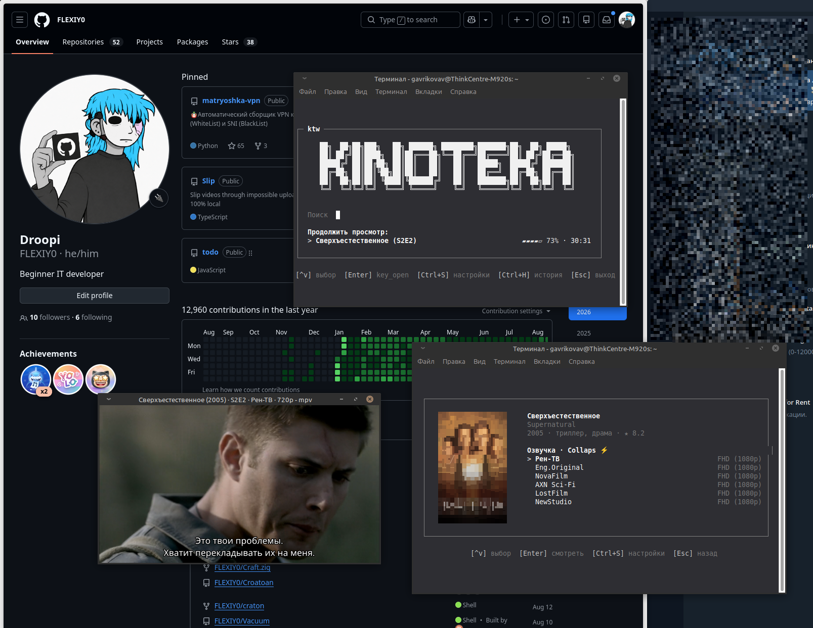

# KinoTeka-Watch (ktw)

Терминальный клиент (TUI) для поиска и просмотра фильмов и сериалов с онлайн-балансеров и торрентов через mpv.



## Возможности

* **Полноэкранный TUI**: интерактивный поиск, карточки фильмов, постеры (Chafa / ImageMagick), выбор сезонов, серий, озвучек и качества.
* **Прямое воспроизведение**: извлечение HLS / DASH потоков без браузера (Collaps, Veoveo, Alloha, Turbo, Kodik, CDNVideoHub).
* **TorrServe & JacRed**: автоматический поиск и стриминг торрент-раздач (4K UHD / 1080p) с автозапуском TorrServer MatriX из коробки.
* **Binge-Watching**: автопереход к следующей серии, сохранение прогресса, таймкодов и истории просмотров.
* **Поддержка mpv**: автоматический выбор русской звуковой дорожки, субтитры, фоновое воспроизведение и встроенный пульт управления (`Ctrl+P`).
* **Атомарный рендеринг**: синхронизированный вывод кадров без задержек и мерцания, поддержка мыши (клики, скролл).

## Установка

```bash
curl -fsSL https://raw.githubusercontent.com/FLEXIY0/KinoTeka-Watch/main/cli/install.sh | sh
```

> **Требования**: [Bun](https://bun.sh) (устанавливается скриптом автоматически), [mpv](https://mpv.io).

## Использование

```bash
ktw                          # Полноэкранный TUI
ktw "Матрица"                # Запуск поиска по названию
ktw 301                      # Карточка фильма по ID Кинопоиска
ktw "Во все тяжкие" -s 1 -e 1 # Запуск конкретного сезона и серии
ktw --doctor                 # Диагностика сети, балансеров и окружения
ktw --update                 # Обновление клиента до последней версии
```

## Горячие клавиши

| Клавиши | Действие |
|---|---|
| `↑` `↓` / `Колёсико мыши` | Навигация по спискам и карточкам |
| `Enter` | Выбрать / Смотреть |
| `e` / `Tab` / `→` | Быстрый переход к списку серий текущего сезона |
| `Esc` | Шаг назад / Выход |
| `Ctrl+S` / `F1` | Настройки (тема, плеер по умолчанию, качество, зеркала) |
| `Ctrl+H` / `F2` | История просмотров |
| `Ctrl+P` / `F4` | Пульт управления фоновым воспроизведением mpv |
| `Ctrl+X` | Остановить фоновое воспроизведение |
| `Space` / `r` | Отметить / сбросить серию как просмотренную (`✓`) |
| `*` / `1-9` / `0` | Выставить личную оценку фильму в истории |
| `Ctrl+C` | Принудительный выход |

## Параметры командной строки

```
ktw [запрос|id] [опции] [-- аргументы mpv]

Опции:
  -s, --season <n>        Номер сезона
  -e, --episode <n>       Номер серии
  -p, --player <имя>      Выбор балансера без диалога (Collaps, Veoveo, Alloha, TorrServe)
  -t, --translation <имя> Выбор озвучки по названию
  -q, --quality <n>       Качество: 1080, 720, max, min
  --iframe                Вывести прямую ссылку на плеер (без запуска mpv)
  --no-mpv                Извлечь HLS/DASH поток и вывести команду mpv
  --json                  Машинный JSON-вывод для скриптов и пайплайнов
  --doctor                Полная диагностика доступности балансеров и API
  --update                Обновление до актуальной версии
  --clean                 Очистка кеша API и постеров
```

## Лицензия

MIT
